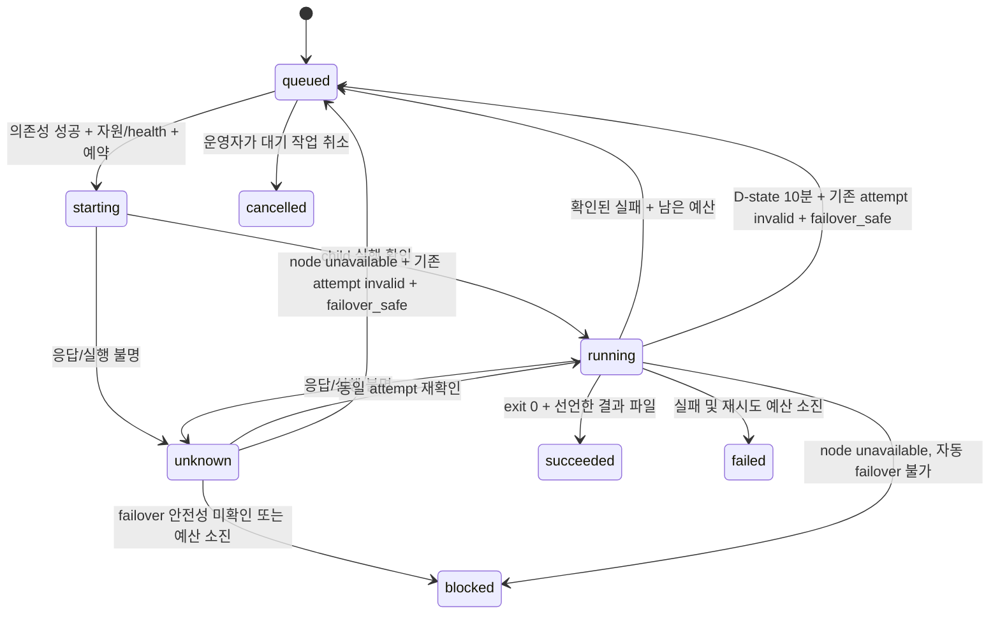
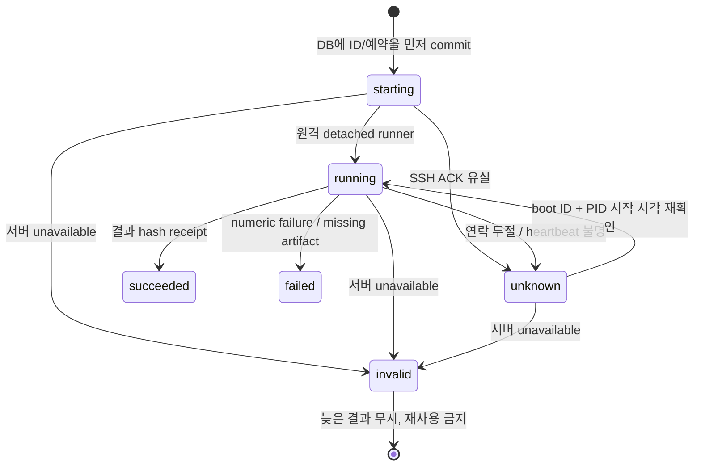
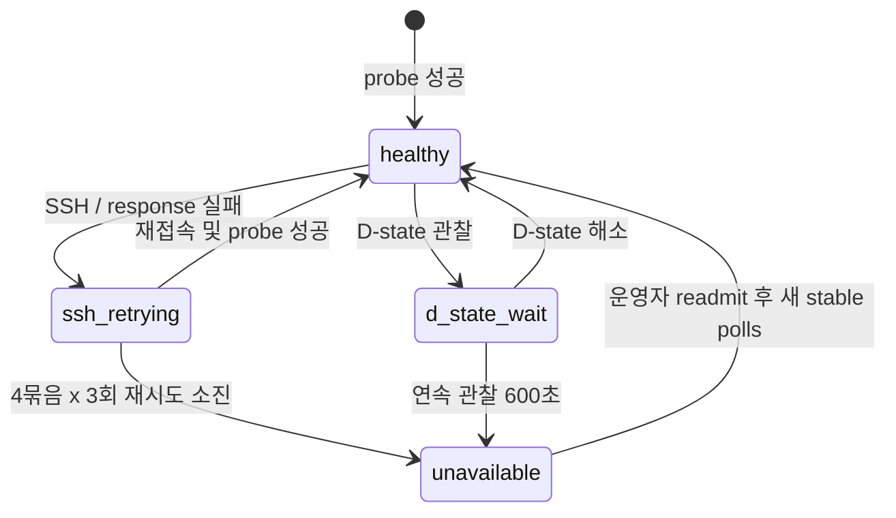
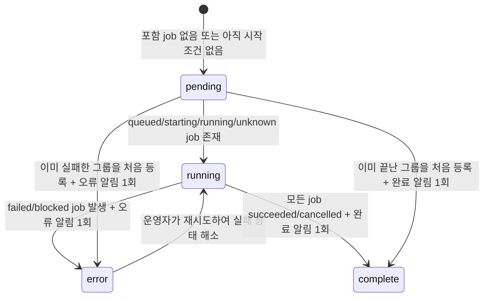

# 상태 머신과 결과 권위

구현: `src/research_scheduler/states.py`, `controller.py`, `store.py`, `notifications.py`.
Job은 완료해야 할 논리 작업, attempt는 실제 실행 한 번, node는 실행 가능성을 뜻합니다.

## Job

의존성/자원 대기는 `queued` 상태의 plan reason이며 실제 실행을 시작한 상태가 아닙니다.
`blocked`는 노드 장애 후 자동 재실행이 불가능한 operator-action 상태입니다.
빠르게 끝난 작업은 중간 running poll 없이 starting/unknown에서 terminal을 확인할 수도 있습니다.
실제 허용 전이는 `states.py`가 검증합니다.

## Attempt

실행 전에 예약을 DB에 기록합니다. 원격에 동일한 attempt 디렉터리가 있으면 새 child를
실행하지 않고 기존 state를 조회합니다. 원격 runner 자체도 exclusive execution claim을 사용합니다.
SSH 응답만 유실된 경우 동일 attempt를 조회하여 복구하며 새 attempt를 만들지 않습니다.

`invalid`는 **논리적 결과 차단**이지 물리 프로세스 종료가 아닙니다. 불명 서버의 기존 계산이
다른 서버의 재실행과 잠시 겹칠 수 있습니다. 전역 side effect가 있는 job은 이 방식으로
안전하게 failover할 수 없으므로 `failover_safe=false`로 두어야 합니다.
권위 있는 downstream은 DB의 succeeded attempt만 사용하고 invalid attempt 경로를 선택하지 않습니다.

## Node

| 장애 탐지 후 시점 | SSH 재시도 |
|---|---|
| 즉시 | 1–3회; 각 응답 timeout 30/60/90초 |
| 5분 | 4–6회; 동일 timeout |
| 10분 | 7–9회; 동일 timeout |
| 15분 | 10–12회; 동일 timeout |

첫 장애를 탐지한 probe는 12회에 포함하지 않습니다. 5/10/15분은 묶음의 시작 기준이고,
개별 timeout과 scheduler tick 지연 때문에 최종 판정은 15분보다 늦을 수 있습니다.
재시도 스케줄은 DB에 보존되므로 controller 재시작으로 카운터를 초기화하지 않습니다.
대기 중 status RPC를 계속 날려 이 retry budget을 우회하지 않습니다.

D-state가 잠깐 나타난 동안에도 새 작업은 시작하지 않지만, 10분 전에 해소되면 기존 실행을
invalid 처리하지 않습니다. 관찰 간격이 120초를 넘으면 연속 지속을 입증할 수 없어 재계산합니다.
PID 하나가 아니라 서버에서 보이는 D-state 존재 여부를 기준으로 하므로 PID가 교체되어도
D-state가 계속 있으면 지속 상태입니다.

`unavailable`은 sticky합니다. probe 자동 재시도를 멈추고 기존 attempt를 차단합니다.
운영자가 서버를 확인한 뒤 `readmit-node`를 사용하면 새 health poll부터 시작합니다.
이 명령은 어떤 서버 복구나 프로세스 종료도 수행하지 않습니다.

## Campaign (실험 그룹)

상태 우선순위는 `error`가 `running`보다 높습니다. 같은 error 상태에서 실패 job 수만 바뀌는 것은
상태 전이가 아니므로 추가 알림을 만들지 않습니다. campaign runtime의 generation과 durable
outbox ID가 controller 재시작 및 중복 poll에도 같은 전이를 한 번만 전송하게 합니다.
webhook이 설정되지 않았거나 일시적으로 실패해도 관찰 상태와 pending outbox는 유지됩니다.
비밀 URL은 campaign 상태 머신의 일부가 아니며 DB에 저장하지 않습니다.

## 운영상 주의

- 출력은 실행마다 다른 `{attempt_dir}`에 기록하세요. 고정 checkpoint 파일을 덮어쓰지 마세요.
- 프로세스 생존만으로 성공 처리하지 않습니다. exit code와 선언된 output 파일을 확인합니다.
- controller를 멈춰도 detached job은 계속 실행됩니다.
- unknown/invalid 상황에서 데이터를 지우거나 프로세스를 자동 kill하지 않습니다.
- 서버별 장애 처리와 shared-storage group 시작 gate는 독립적입니다. 공유 backend가
  불안정하면 다른 group member도 기다릴 수 있습니다.
- 외부 프로세스와 다른 스케줄러는 이 DB 예약을 존중하지 않을 수 있습니다.
  자원 snapshot과 launch 사이의 외부 경쟁까지 막는 hard isolation은 제공하지 않습니다.
